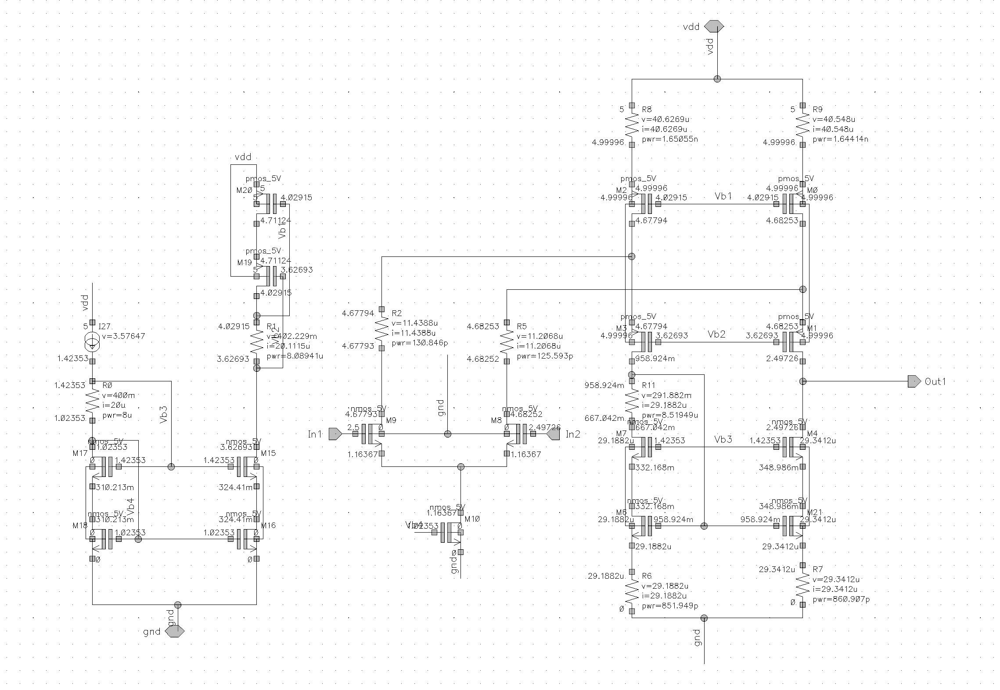
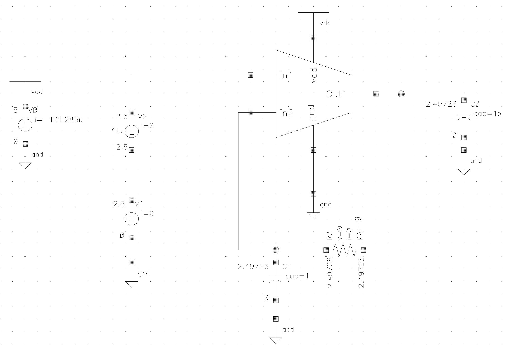
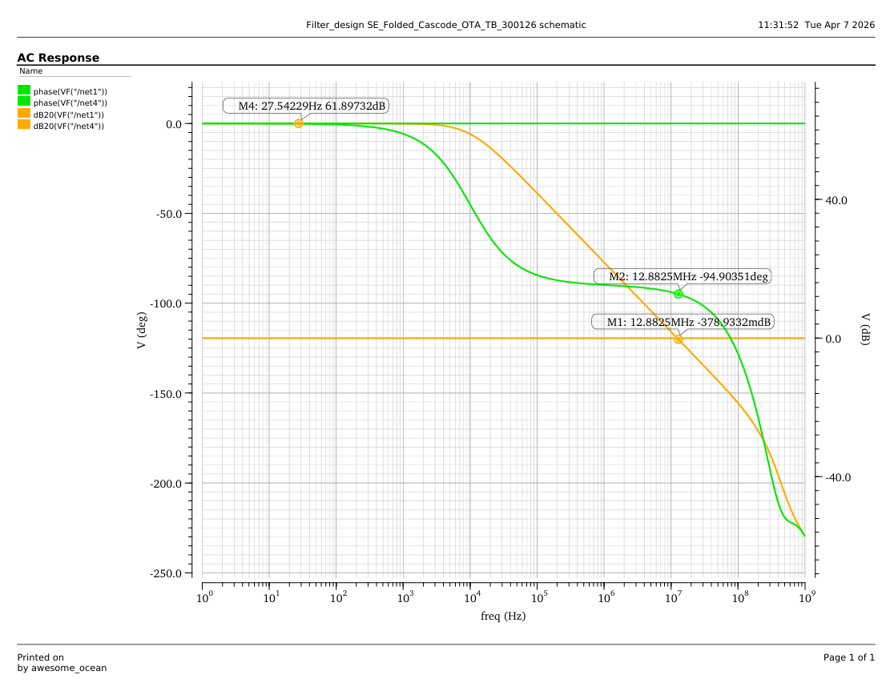

# Folded Cascode Amplifier

## Overview
This repository contains the schematic design, testbench setup, and simulation results for a Folded Cascode Amplifier. The primary objective of this design was to achieve a targeted Unity Gain Bandwidth (UGB) of 10 MHz while ensuring robust stability and high open-loop gain. 

Key architectural choices include the implementation of a **cascode current mirror** for precise biasing and enhanced output resistance. To ensure optimal performance, the transistor sizing was rigorously optimized, and all MOSFETs were verified to be operating strictly in the saturation region using overdrive voltage analysis.

## Specifications & Performance Metrics
The circuit was designed and simulated using Cadence Virtuoso. The final design successfully met and exceeded all targeted parameters, including bandwidth, gain, and stability margins.

| Parameter | Target | Achieved |
| :--- | :--- | :--- |
| **Unity Gain Bandwidth (UGB)** | 10 MHz | 12.88 MHz |
| **Open-Loop AC Gain** | > 60 dB | 61.89 dB |
| **Phase Margin** | > 60° | 85.1° |

## Testbench Configuration
The amplifier's AC response was characterized using a DC-closed loop and AC-open loop testbench configuration. The specific operating conditions applied in the testbench are:

* **Supply Voltage ($V_{DD}$):** 5 V
* **Input Common-Mode Voltage:** 2.5 V
* **Capacitive Load ($C_L$):** 1 pF

## Schematics and Simulation Results

### 1. Circuit Schematic
*(Upload your folded_cascode_amp.png to an `images` folder in your repo to display it here)*

### 2. Characterization Testbench
*(Upload your folded_cascode_TB.png to the `images` folder)*

*The testbench utilizes a 5V supply with a 2.5V common-mode input and a 1 pF load capacitor.*

### 3. AC Response (Bode Plot)
*(Upload an image version of your AC response plot to the `images` folder)*

*The AC response plot demonstrates a DC gain of 61.89 dB and a UGB of 12.88 MHz with a phase margin of 85.1°.*

## Tools Used
* **EDA Tool:** Cadence Virtuoso
* **Analyses Performed:** DC Operating Point, AC Analysis
